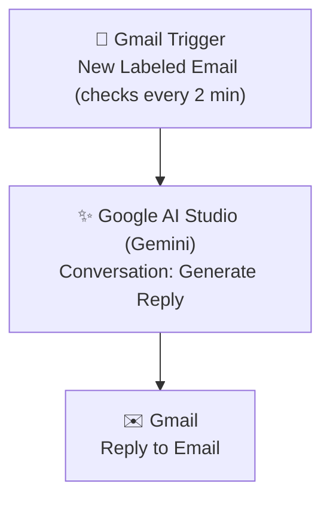

# AI-Email-responder-Gemini
A lightweight, AI-powered Zapier automation that detects newly labeled Gmail emails, generates a context-aware reply using Google AI Studio (Gemini), and automatically sends the response — enabling instant, intelligent first-line email replies without manual drafting.
#  AI Email Responder — Gmail + Google AI Studio (Gemini)

> A lightweight, AI-powered Zapier automation that detects newly labeled Gmail emails, generates a context-aware reply using Google AI Studio (Gemini), and automatically sends the response — enabling instant, intelligent first-line email replies without manual drafting.


---

## 📋 Table of Contents

- [Project Overview](#-project-overview)
- [Workflow Diagram](#-workflow-diagram)
- [Features](#-features)
- [Technologies Used](#-technologies-used)
- [Folder Structure](#-folder-structure)
- [Setup Guide](#-setup-guide)
- [Use Cases](#-use-cases)
- [Screenshots](#-screenshots)
- [Troubleshooting](#-troubleshooting)
- [Best Practices](#-best-practices)
- [Contributing](#-contributing)
- [License](#-license)
- [Author](#-author)

---

##  Project Overview

Responding promptly to every email is difficult to sustain manually, especially for recurring inquiries, support requests, or leads that need a fast first response. **AI Email Responder** solves this with a simple three-step Zapier automation that pairs Gmail with **Google AI Studio (Gemini)** to generate and send intelligent replies automatically.

Whenever an email arrives with a specific Gmail label, the workflow:

1. Detects the new labeled email via Gmail (checked every 2 minutes).
2. Passes the email content to **Google AI Studio (Gemini)** through a Conversation step, which generates a relevant, natural-language reply.
3. Sends that AI-generated reply directly back to the sender via Gmail.

This is a focused, minimal automation — ideal as a foundation that can later be extended with classification, logging, or approval steps, while demonstrating a clean, working integration between Gmail and a large language model via Zapier.

---

##  Workflow Diagram



A detailed breakdown of each step and the reasoning behind this design is available in [`docs/workflow-diagram.md`](docs/workflow-diagram.md).

---

##  Features

- **Label-Based Triggering** — Only emails with a specific Gmail label enter the automation, giving precise control over which messages get an AI reply.
- **AI-Generated Responses** — Uses Google AI Studio's Gemini model to craft natural, context-aware replies instead of static templates.
- **Fully Automated Reply Loop** — From detection to response, the entire cycle runs with no manual intervention.
- **Fast Response Time** — Polls every 2 minutes, keeping reply turnaround short.
- **Minimal, Extensible Design** — A clean three-step core that can be expanded with logging, filtering, approval steps, or multi-channel notifications.
- **No-Code Implementation** — Built entirely in Zapier, making it easy to maintain and adjust without writing code.

---

##  Technologies Used

| Tool / Service | Role in Workflow |
|---|---|
| **Zapier** | Core automation/orchestration platform |
| **Gmail** | Trigger (new labeled email) and action (sending the reply) |
| **Google AI Studio (Gemini)** | AI conversation step that generates the reply content |

---

##  Folder Structure

```
ai-email-responder-gemini/
│
├── README.md                     # Main project documentation (this file)
├── LICENSE                       # MIT License
├── CONTRIBUTING.md               # Guidelines for contributing to this project
│
├── docs/
│   └── workflow-diagram.md       # Detailed step-by-step workflow breakdown
│
└── screenshots/
    └── README.md                 # Index/placeholder for workflow & setup screenshots
```

> **Note:** As this is a Zapier-based automation (not a code application), the repository is documentation-first — structured to showcase design decisions and configuration clearly, the same way source files showcase logic in a coded project.

---

##  Setup Guide

Follow these steps to recreate this automation in your own Zapier account.

### Prerequisites

- A Zapier account with access to premium apps (Google AI Studio integration may require a paid Zapier plan)
- A connected Gmail account
- A Gmail label created for the emails you want the AI to respond to (e.g., "AI-Reply")
- A Google AI Studio account with API access enabled for Gemini

### Step-by-Step Configuration

**1. Trigger — Gmail: New Labeled Email**
   - App: `Gmail`
   - Trigger event: `New Labeled Email`
   - Select the specific Gmail label you want to monitor (e.g., "AI-Reply" or "Needs Response").
   - Polling interval: every 2 minutes.

**2. Action — Google AI Studio (Gemini): Conversation**
   - App: `Google AI Studio (Gemini)`
   - Action event: `Conversation`
   - Map the email subject and body from Step 1 into the prompt input.
   - Write a clear system/context instruction, for example: *"You are a helpful assistant replying to customer emails. Write a concise, polite, and relevant reply based on the email content below."*
   - Adjust temperature/creativity settings if available, depending on how consistent vs. varied you want the tone to be.

**3. Action — Gmail: Reply to Email**
   - App: `Gmail`
   - Action event: `Reply to Email`
   - Set the "Thread" field to reference the original email from Step 1, so the reply appears in the same conversation thread.
   - Map the AI-generated text from Step 2 into the email body field.

### Testing the Zap

1. Turn the Zap on in Zapier.
2. Apply the configured Gmail label to a test email.
3. Wait for the next polling cycle (up to 2 minutes) and confirm:
   - The Zap triggers on the labeled email.
   - Google AI Studio (Gemini) generates a relevant reply.
   - Gmail sends the reply within the same email thread.
4. Review the AI-generated content for tone and accuracy, and refine your Gemini prompt if needed.

---

##  Use Cases

- **Freelancers & Consultants** — Send instant acknowledgment or informational replies to common client questions.
- **Customer Support (Tier 1)** — Automatically respond to frequently asked questions labeled for AI handling.
- **Sales Inquiries** — Provide immediate, helpful first responses to inbound leads while a human follow-up is prepared.
- **Small Business Owners** — Maintain fast response times without staffing a dedicated inbox manager.
- **Personal Productivity** — Auto-reply to specific categories of personal email (e.g., scheduling requests) with contextually appropriate responses.

---

##  Screenshots

Screenshots of the live Zap configuration and sample outputs are organized in the [`screenshots/`](screenshots/) folder.

| Screenshot | Description |
|---|---|
| `01-zap-overview.png` | Full 3-step Zap overview in Zapier |
| `02-gmail-trigger-config.png` | Gmail "New Labeled Email" trigger configuration |
| `03-gemini-conversation-config.png` | Google AI Studio (Gemini) Conversation step configuration |
| `04-gmail-reply-config.png` | Gmail "Reply to Email" action configuration |
| `05-sample-ai-reply.png` | Example AI-generated reply sent to a test email |

> Add your actual screenshots to the `screenshots/` folder using the filenames above, or update the table to match your naming convention.

---

##  Troubleshooting

| Issue | Likely Cause | Solution |
|---|---|---|
| Zap doesn't trigger on labeled emails | Label not applied correctly, or polling delay | Confirm the exact label is applied in Gmail; wait for the next 2-minute poll cycle |
| Gemini step returns an empty or irrelevant reply | Prompt lacks context, or email body wasn't mapped correctly | Review the field mapping from Step 1; refine the prompt with clearer instructions and examples |
| Reply is sent as a new email instead of a threaded reply | Thread ID not mapped in the Gmail "Reply to Email" step | Explicitly map the original email's thread/message ID from Step 1 |
| AI-generated tone is inconsistent | No fixed tone instruction in the prompt | Add explicit tone guidance (e.g., "professional and concise") to the Gemini prompt |
| Zap authentication errors on Gmail or Google AI Studio | Expired or revoked account connection | Reconnect the relevant account in Zapier's App Connections settings |
| Duplicate replies sent for the same email | Label re-applied or Zap re-triggered manually | Ensure the label is only applied once per email; avoid manually re-running the Zap on already-processed emails |

---

##  Best Practices

- **Write a clear, scoped AI prompt.** Give Gemini explicit context about tone, length, and purpose so replies stay consistent and professional.
- **Use a dedicated label.** Keep the triggering label exclusive to emails meant for AI handling, to avoid unintended auto-replies.
- **Always reply in-thread.** Mapping the correct thread ID keeps conversations organized and avoids confusing the recipient with a disconnected new email.
- **Review AI output periodically.** Even with a good prompt, periodically audit sent replies to catch tone drift or factual errors early.
- **Start narrow, then expand.** Begin with a single, well-defined use case (e.g., FAQ replies) before broadening the label scope to more email types.
- **Respect task/API limits.** Monitor your Zapier task usage and Google AI Studio API quota, especially if reply volume grows.

---

##  Contributing

Contributions, suggestions, and improvements are welcome! Please see [CONTRIBUTING.md](CONTRIBUTING.md) for guidelines on how to propose changes, report issues, or suggest new features for this automation.

---

## License

This project is licensed under the [MIT License](LICENSE) — feel free to use, modify, and adapt this workflow for your own projects.

---

## Author

** AI SMART GALAXY" ( https://aismartgalaxy.com/)
Automation Builder | Zapier & AI-Powered Workflow Enthusiast

This project is part of an ongoing portfolio of no-code and AI-powered automation projects, showcasing practical business use cases built with Zapier — from beginner-level integrations to advanced, AI-driven, multi-step workflows.

-  Open to freelance automation projects and collaborations
-  Feel free to connect for questions, feedback, or automation consulting

---

 **If you found this project useful or inspiring, consider starring the repository!**
